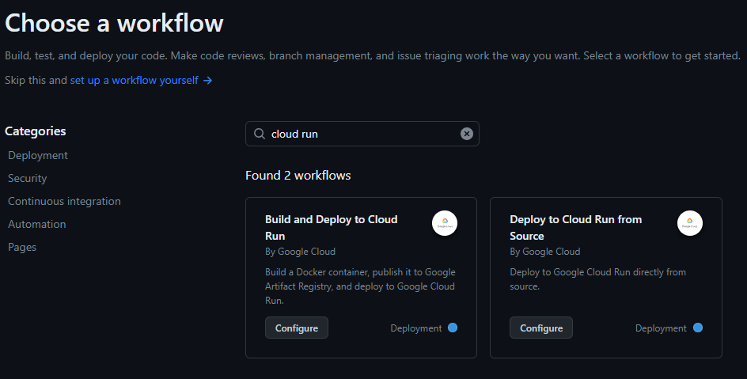
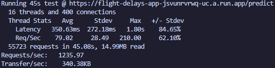
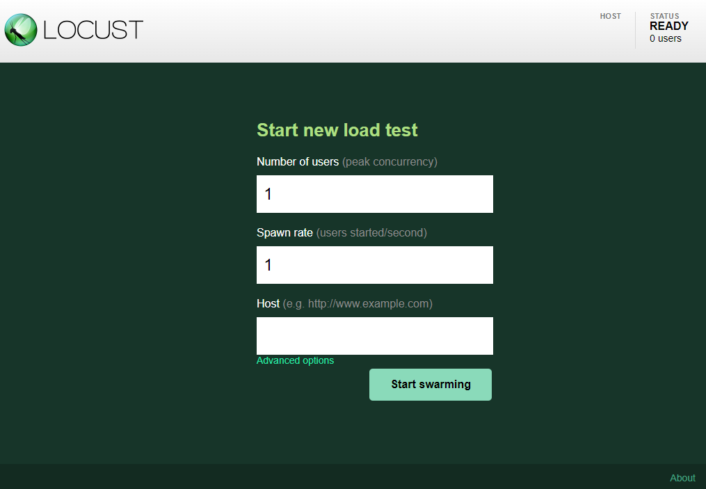
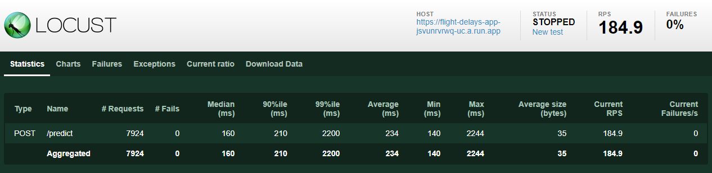
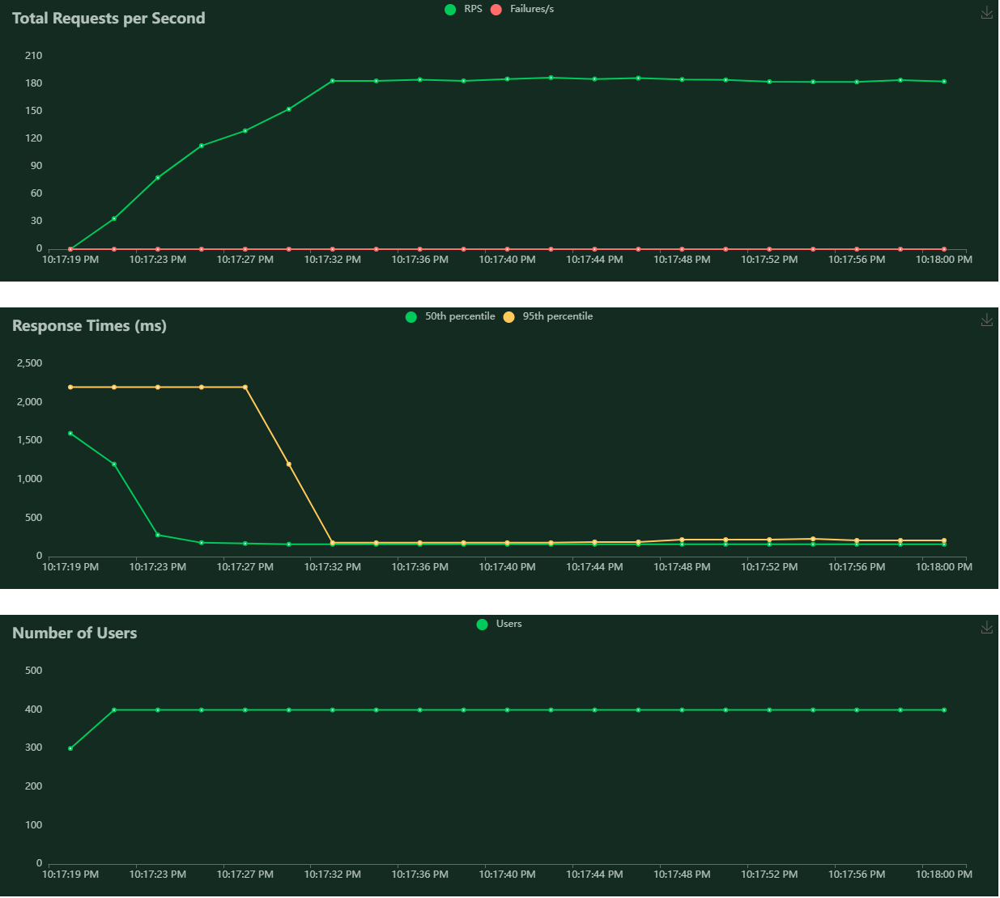

# Deploying Flight Delay Prediction API on Google Cloud Run

This guide provides step-by-step instructions to deploy a Flight Delay Prediction API as a containerized application on Google Cloud Run using a GitHub Actions workflow. The API is built using FastAPI and utilizes a trained LGBMClassifier model to predict flight delays.

## Prerequisites

Before proceeding, make sure you have the following (more detailed steps going forward!):

- A Google Cloud Platform (GCP) account
- Project created on GCP
- Docker installed on your local machine
- GCP CLI (gcloud) installed on your local machine
- Google Artifact Registry enabled for your project
- Google Cloud Run enabled for your project

## Context of this Exercise

Suppose we are working in a data team with several talented Data Scientists. One of them, let's call him *Juan*, has been running some experiments with a ML model and gives us the task of building a service to expose his trained model as an API to be consumed by other people outside the data team.

*Juan* gives us a [Jupyter Notebook](to-expose.ipynb) where he trained multiple models that **predict the probability of a flight being delayed, for flights arriving to or departing from the Santiago de Chile (SCL) airport**.

After reviewing his Notebook, we come up with some observations and propose some changes, which are described with more detail in a new version of the [Notebook](to-expose-v2.ipynb). More importantly, after some discussion with *Juan*, we decide to finally use a LightGBM Classifier as the model we will be deploying with an API.

The Flight Delay Prediction API is designed to accept flight details as input and returns the predicted delay status (probability of the flight being delayed). The API will be containerized and deployed on Google Cloud Run or we can run it locally to try it out using Docker.

## Model Performance Comparison

These are the performance metrics for the different models that were trained:

| Model               | Accuracy | Precision | Recall | F1 Score | AUC Score |
|---------------------|----------|-----------|--------|----------|-----------|
| Logistic Regression |   0.82   |    0.52   |  0.03  |   0.06   |   0.66    |
| XGBoost v1 (plain)         |   0.82   |    0.70   |  0.02  |   0.04   |   0.65    |
| XGBoost v2 (using "important features")         |   0.82   |    0.59   |  0.01  |   0.02   |   0.63    |
| XGBoost v3 (using hyperparameter tuning)         |   0.82   |    0.63   |  0.04  |   0.07   |   0.67    |
| XGBoost v4 (using upsampling)         |   0.68   |    0.63   |  0.19  |   0.29   |   0.67    |
| XGBoost (using Categorical)         |   0.82   |    0.60   |  0.14  |   0.23   |   0.73    |
| XGBoost (using Categorical and hyperparameter tuning)        |   0.82   |    0.60   |  0.15  |   0.25   |   0.73    |
| LightGBM (using Categorical)        |   0.82   |    0.53   |  0.19  |   0.28   |   0.72    |
| LightGBM (using Categorical and hyperparameter tuning)         |   0.83   |    0.64   |  0.13  |   0.22   |   0.73    |

Please look into this [Notebook](to-expose-v2.ipynb) for more training details and differences between the models. As a brief summary, the chosen model was LightGBM using Categorical and hyperparameter tuning. This decision was mainly made because of LightGBM models are lightweight (in comparison to XGBoost), they offer nice features for Categorical variables that are compatible with Sci-kit Learn, and they get good performance in general.

The trained model can be found [here](./app/flight_delays_lgb_model.pkl). This file was generated using the `joblib` package:

```python
import joblib

model_data = {
    "trained_model": best_model,
    "dia_values": x_train_v2["DIA"].cat.categories.tolist(),
    "mes_values": x_train_v2["MES"].cat.categories.tolist(),
    "dianom_values": x_train_v2["DIANOM"].cat.categories.tolist(),
    "tipovuelo_values": x_train_v2["TIPOVUELO"].cat.categories.tolist(),
    "opera_values": x_train_v2["OPERA"].cat.categories.tolist(),
    "siglades_values": x_train_v2["SIGLADES"].cat.categories.tolist(),
    "periododia_values": x_train_v2["PERIODODIA"].cat.categories.tolist(),
}

joblib.dump(model_data, "flight_delays_lgb_model.pkl")
```

It's also worth noting that in addition to the trained model itself, this object stores the list of possible values for each Categorical variable used in the model.

## Building the Prediction API with FastAPI

FastAPI is a modern, fast (high-performance), web framework for building APIs with Python 3.7+ based on standard Python type hints. FastAPI's syntax is simple and fast to use, although we have to consider it doesn't come integrated with a webserver. It is specifically designed to build APIs. So for serving the APIs, it's common to use uvicorn which is a lightning-fast ASGI server implementation.

So enough about FastAPI, let's go with the prediction API itself. Our code is actually very simple right now, we only wanted to be able to make predictions using the model we trained, but it could be improved with more complex behaviour. The code for the API is inside [`app/app.py`](./app/app.py) and it could be divided in the following sections:

1. Define the schema of the input and output for your requests. The main objective here is to type requests and responses body with standard python types. For example:
    ```python
    class FlightInformation(BaseModel):
        DIA: int
        MES: int
        DIANOM: str
        TIPOVUELO: str
        OPERA: str
        SIGLADES: str
        TEMPORADAALTA: int
        PERIODODIA: str
    ```
2. Load the pretrained model. This is pretty straightforward, we already have the trained model and we want the API to have it available to use it for predictions:
    ```python
    # Load the model
    model_data = {}
    model_data = joblib.load("/app/flight_delays_lgb_model.pkl")
    model = model_data["trained_model"]
    ```
3. Start the app. That's it, really: `app = FastAPI()`
4. Define the endpoints of the app. The idea here is to define a prediction endpoint that receives some information about a flight, the input is processed as necessary to pass it in a valid format to the trained model and a prediction gets generated with the probability of the flight being delayed or not:
    ```python
    # Inference endpoint
    @app.post("/predict", response_model=PredictionOut)
    def predict(payload: FlightInformation):
        request_df = pd.DataFrame([payload.dict()])
        request_df["DIA"] = pd.Categorical(
            request_df["DIA"], categories=model_data["dia_values"]
        )
        request_df["MES"] = pd.Categorical(
            request_df["MES"], categories=model_data["mes_values"]
        )
        request_df["DIANOM"] = pd.Categorical(
            request_df["DIANOM"], categories=model_data["dianom_values"]
        )
        request_df["TIPOVUELO"] = pd.Categorical(
            request_df["TIPOVUELO"], categories=model_data["tipovuelo_values"]
        )
        request_df["OPERA"] = pd.Categorical(
            request_df["OPERA"], categories=model_data["opera_values"]
        )
        request_df["SIGLADES"] = pd.Categorical(
            request_df["SIGLADES"], categories=model_data["siglades_values"]
        )
        request_df["PERIODODIA"] = pd.Categorical(
            request_df["PERIODODIA"], categories=model_data["periododia_values"]
        )
        prediction = model.predict_proba(request_df)[0, 1]
        result = {"delay_proba": prediction}
        return result
    ```
    In this particular case, the preprocessing consists of converting multiple variables from the request into valid Categorical columns and pass them in a Dataframe to the trained model, which in return gives us the probability of a delay.

And that's it! Technicaly, just having the `app.py` and running `uvicorn` would be enough to get the app up and running (try it by yourself by going to the `/app` folder and run `uvicorn app:app --reload` in your computer), but we will be running this locally in a better way by doing it with Docker.

## Containerize the API with Docker (that we'll also use with Google Cloud!)

We can create a Docker Container to package all that's necessary for this application to work and then test it locally by running the container image. The script for creating the image can be used locally but more importantly, it can be used to build, publish and deploy the Docker image to any cloud provider and make a scalable app. In this case, our Dockerfile looks like this:

```Dockerfile
# Start from a base image
FROM python:3.9-slim

# Set the working directory
WORKDIR /app

# Copy the requirements file into the container
COPY requirements.txt requirements.txt

# Install the required packages
RUN pip install --upgrade pip
RUN pip install -r requirements.txt

# Install libgomp1
RUN apt-get update && apt-get install -y libgomp1

# Copy the application code into the container
COPY ./app/app.py /app
# Copy the model object
COPY ./app/flight_delays_lgb_model.pkl /app

# Expose the app port
EXPOSE 8080

# Run command
CMD ["uvicorn", "app:app", "--host", "0.0.0.0", "--port", "8080"]
```

In summary, all that this script does is follow a set of instructions (like a recipe) to build the image. It starts by using a base Python image, it installs the requirements, it copies any code or files necessary and it executes a command to launch an application.

Then, using Docker we can build the image using the command `docker build -t <image-name> .`

## Run the Container Locally

To run the container locally, execute the following command (it's also possible to do it with Docker Desktop):

```
docker run -p 8080:8080 <image-name>
```

Access the API at `http://localhost:8080` and test the endpoints.

## Run GitHub Action Workflow to Deploy to Cloud Run

GitHub Actions is a continuous integration and continuous delivery (CI/CD) platform that allows you to automate your build, test, and deployment pipeline. You can create workflows that build and test every pull request to your repository, or deploy merged pull requests to production ([read more here](https://docs.github.com/en/actions/learn-github-actions/understanding-github-actions)). It's a great platform to automate build and deploy processes and it has multiple templates we can use directly in our repos.

On the other hand, Cloud Run is a managed compute platform that lets you run containers directly on top of Google's scalable infrastructure ([read more here](https://cloud.google.com/run/docs/overview/what-is-cloud-run)). It's a great tool for building services without worrying too much on infrastructure and scalability, because Google takes care of that for you depending on the load your app has.

The GitHub Actions workflow we use in this project will automatically build, publish to Artifact Registry, and deploy the Docker image to Google Cloud Run whenever there is a commit to the `main` branch. It's based on a template that's easy to find in the `Actions` templates GitHub offers. Just have to go in your repo, go to Actions and search for: "Build and Deploy to Cloud Run":



There are some env variables and secrets that have to be set up and one important thing to consider, in the beginning of the workflow there is a very relevant commented chunk of code. Please follow those steps to set everything correctly, and maybe look at the working workflow in this repo.

The workflow includes the following steps:

1. Authenticate to Google Cloud.
2. Authenticate Docker to Artifact Registry.
3. Build the Docker container.
4. Publish it to Google Artifact Registry.
5. Deploy it to Cloud Run.

Besides being run automatically, this workflow can also be launched manually and it will deploy the image to Cloud Run, exposing the API and returning the URL for the service, for example: `https://flight-delays-app-jsvunrvrwq-uc.a.run.app`.

## Run Load Tests on the Deployed Cloud Run App

Once the API is deployed on Cloud Run, you can run load tests to evaluate its performance and scalability. One way to perform these kinds of tests is using [`wrk`](https://github.com/wg/wrk). wrk is a modern HTTP benchmarking tool capable of generating significant load when run on a single multi-core CPU.

A [`request.lua`](./tests/request.lua) LUA script file is included in this repo, which simply defines the POST request body and header to send to the deployed API. In the body we send an example with the relevant features that the trained model accepts and uses to make the prediction. The steps to run the load test are:

1. Install `wrk` on your local machine.
2. Run `wrk -t12 -c200 -d45s -s ./tests/request.lua https://flight-delays-app-jsvunrvrwq-uc.a.run.app/predict`, where:
    * `-t12` represents 12 threads.
    * `-c200` represents using 400 HTTP connections open.
    * `-d45s` represents the test duration.

Here are the results for a test I ran using my local machine using 16 threads and 400 connections:



The output shows the normal distribution parameters for the latency and the request per second statistics. We can see that the latency is high, but at least is less than 1s. The Stdev is pretty high so the Avg is not that trustworthy. The main goal to improve this would be to reduce the latency and increase the Req/Sec ratio. One way to achieve this using our current solution would be to modify the deployment workflow so that we use more than 1 Cloud Run Service, so that we do horizontal scaling and distribute the traffic with a load balancer. Another solution would be to increase the resources of the current service to scale vertically. It's also important to check the code of the app and see what could be done in a more efficient way.

Another popular way to perform load testing is by using Locust, which is pretty similar to wrk but it lets you see some visualizations over your tests. It also offers flexibility when writing test scripts because they are configured in plain Python. A [`locust_test.py`](./tests/locust_test.py) is included in this repo, which uses the same POST request we used with wrk. To be able to run this test please follow the next steps:

1. Install Locust on your local machine (`pip install locust`).
2. Run `locust -f ./tests/locust_test.py`. This will start a Locust server, which has a simple UI you can control in a browser:



Similar to wrk, we can establish the number of concurrent connections, the spawn rate of the users and in the advanced options there is the option to limit the time of the test.





## Possible Improvements

* Deploy to more than 1 Cloud Run Service and load balance incoming requests.
* Use Cloud Storage to store the ML Model instead of having it in the image.
* Have a continuous training pipeline for retraining of the ML model in case we have an established flow of data and we want to update the model.
* Use experiment tracking tools like MLFlow or Weights & Biases to keep track of experiments, models, datasets, etc.
* Use ML observability and monitoring tools like Arize AI or Evidently AI to analyze model performance over time and detect data drift.
* Use Google Kubernetes Engine for deployment of the app in a scalable way.
* Use Terraform to build infrastructure using code.
* Work on the FastAPI endpoints, add exception and error handling, unit tests.
* Add a GitHub Actions workflow to do a clean up of the Google Cloud Resources used in this project.
